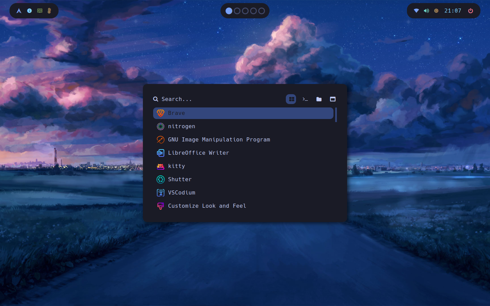

# Arch configuration
<div align="center">
  
</div>

# Installation

Assuming that you have an empty Arch. Haven't tested it yet in real life. 

All the needed packages:
```
bspwm, sxhkd, sddm, grub, nitrogen, lxsession, ibus-bamboo, picom, eww, python, lua, rust (rustup, cargo), btop, cava, dunst, ncmpcpp, mpd, fish, kitty, neofetch, maxfetch, neovim, ranger, rofi, starship, weather, alsamixer, networkmanager, ttf-hack-nerd, cbonsai, pipes-rs, tty-clock, lolcat, beautyline
```

All of the above packages are always available on pacman and aur.

After installing all of them, you can clone this repo locally, and apply it to your .config/ directory (for grub configuration: /boot/ directory). Note that this config assumes that your $XDG_CONFIG_HOME is ~/.config.

Bonus: I have some "custom themes" (sddm), you can check it out here: [SDDM SUGAR CANDY THEME](https://github.com/imindMan/sddm-sugar-candy). 

And finally, (fix some bugs), enjoy :)))))
